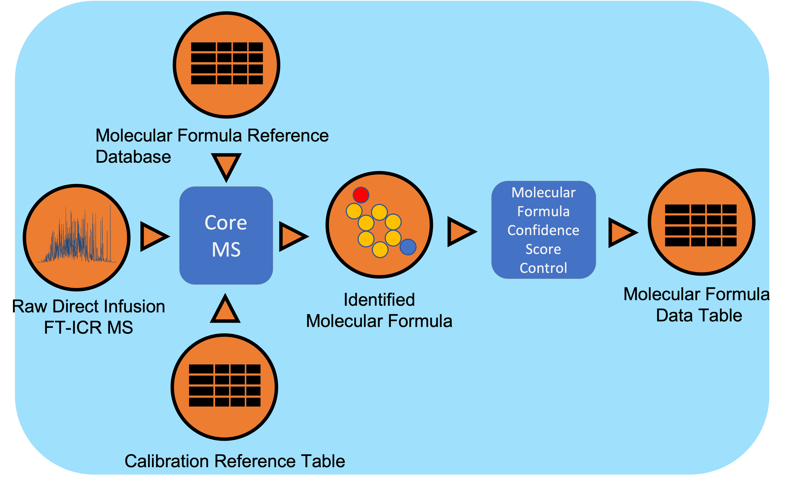

Natural Organic Matter Workflow
================================

Workflow Overview
-------

Direct Infusion Fourier Transform mass spectrometry (DI FT-MS) data undergoes signal processing and molecular formula assignment leveraging EMSL’s CoreMS framework. Raw time domain data is transformed into the m/z domain using Fourier Transform and Ledford equation. Data is denoised followed by peak picking, recalibration using an external reference list of known compounds, and searched against a dynamically generated molecular formula library with a defined molecular search space. The confidence scores for all the molecular formula candidates are calculated based on the mass accuracy and fine isotopic structure, and the best candidate assigned as the highest score.

Workflow Dependencies
---------------------

Third party software
~~~~~~~~~~~~~~~~~~~~

- CoreMS (2-clause BSD)
- Click (BSD 3-Clause "New" or "Revised" License)

Database 
~~~~~~~~~~~~~~~~
- CoreMS dynamic molecular database search and generator

Workflow Availability
---------------------

The workflow is available in GitHub:
https://github.com/microbiomedata/enviroMS

The container is available at Docker Hub (microbiomedata/metaMS):
https://hub.docker.com/r/microbiomedata/enviroms

The python package is available on PyPi:
https://pypi.org/project/enviroMS/

The databases are available by request.
Please contact NMDC (support@microbiomedata.org) for access.

Test datasets
-------------
https://github.com/microbiomedata/enviroMS/tree/master/data

Execution Details
---------------------

Please refer to: 

https://github.com/microbiomedata/enviroMS#enviroms-installation

Inputs
~~~~~~~~

- Supported format for Direct Infusion FT-MS data:  
   - Thermo raw file (.raw)  
   - Bruker raw file (.d)
   - Generic mass list in profile and/or centroid mode (inclusive of all delimiters types and Excel formats)
- Calibration File:
    - Molecular Formula Reference (.ref) 
- Parameters:
    - CoreMS Parameter File (.json)
    - EnviroMS Parameter File (.json)
  
Outputs
~~~~~~~~

- Molecular Formula Data-Table, containing m/z measuments, Peak height, Peak Area, Molecular Formula Identification, Ion Type, Confidence Score, etc.  
    - CSV, TAB-SEPARATED TXT
    - HDF: CoreMS HDF5 format
    - XLSX : Microsoft Excel
- Workflow Metadata:
    - JSON

Requirements for Execution
--------------------------

- Docker Container Runtime
  or 
- Python Environment >= 3.8
  and 
- Python Dependencies are listed on requirements.txt

Version History
---------------

- 4.1.5

Point of contact
----------------

Package maintainer: Yuri E. Corilo <corilo@pnnl.gov>
